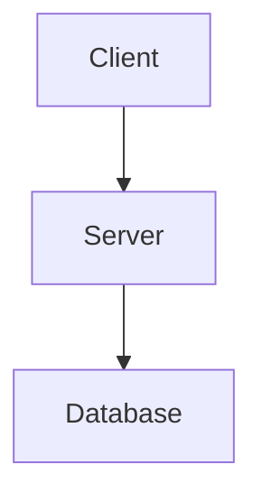

<!-- source: fixit-docs/content/en/documentation/content-management/markdown-syntax/extended/index.md -->
<!-- source: FixIt/layouts/_markup/ -->

# Render Hooks Reference

FixIt provides 14 render hooks under `layouts/_markup/` that extend Hugo's default Markdown rendering. These hooks intercept specific Markdown elements and apply custom HTML output with FixIt features.

Hook files: `render-codeblock` (+ specialized `render-codeblock-mermaid` / `-echarts` / `-file-tree` / `-timeline` / `-json` / `-toggle` / `-fixit`), `render-heading`, `render-image`, `render-link`, `render-table`, `render-blockquote-alert`, `render-passthrough`.

---

## render-codeblock

Intercepts fenced code blocks (`render-codeblock.html` -> `plugin/code-block-wrapper.html`). Default behavior adds copy button, line numbers, and syntax highlighting. Specialized renderers activate for specific language identifiers.

### Standard code blocks

````markdown
```python {title="example.py", linenos=true, hl_lines=[2]}
def hello():
    print("Hello FixIt!")
    return True
```
````

**Options via markdown attributes:**

| Option | Description | Type |
| :----- | :---------- | :--- |
| `title` | Code block title | `string` |
| `name` | Tab item name (for grouped tabs) | `string` |
| `group` | Tab group name | `string` |
| `filename` | Code block filename | `string` |
| `before_tabs` | Content shown before tab items (tabbed blocks / toggle) | `string` |
| `linenos` | Show line numbers | `bool` |
| `hl_lines` | Highlight lines | `array` |
| `max_shown_lines` | Collapse after N lines (`maxShownLines` deprecated) | `int` |
| `shadow` | Shadow style (`always` / `hover` / `never`) | `string` |
| `mode` | Wrapper style: `classic` (default) / `mac` / `simple` | `string` |
| `wrapper_class` | Extra class on wrapper (`wrapperClass` deprecated) | `string` |
| `copyable` / `downloadable` / `fullscreen` / `editable` | Header action buttons (classic mode) | `bool` |
| `line_nos_toggler` / `line_wrap_toggler` | Header toggles (classic mode) | `bool` |
| `.line-wrapping` | Enable line wrapping | class |

Site defaults live in `[params.codeblock]` (`wrapper`, `mode`, `max_shown_lines`, `copyable`, `shadow`, ...). Per-page overrides go in front matter under `codeblock:`.

### Specialized code fence renderers

These language identifiers trigger dedicated renderers instead of syntax highlighting:

| Language | Description |
| :------- | :---------- |
| `mermaid` | Diagrams (flowchart, sequence, gantt, pie, etc.) |
| `echarts` | Interactive charts (JSON, YAML, TOML, or JS object literal) |
| `file-tree` | Interactive directory tree from inline YAML/JSON/TOML |
| `timeline` | Chronological event display from inline YAML |
| `json` | Collapsible JSON viewer (see options below) |
| `toggle` | Config format toggles for TOML / YAML / JSON of the same data |
| `fixit` | Dev-only easter egg (theme info JSON); ignored in production |

**`goat` note:** docs describe a `` ```goat `` ASCII diagram fence, but FixIt source has **no** `render-codeblock-goat` hook and no goat library. It is a code fence language only -- prefer `mermaid` for diagrams.

Example -- mermaid code fence:

````markdown

````

Example -- echarts code fence:

````markdown
```echarts
{
  "xAxis": { "type": "category", "data": ["Mon","Tue","Wed"] },
  "yAxis": { "type": "value" },
  "series": [{ "type": "line", "data": [150, 230, 224] }]
}
```
````

### toggle code fence

`toggle` is its **own language identifier** (not an attribute). Content is one config object (TOML, YAML, or JSON); FixIt renders tabbed, syntax-highlighted views of all three formats.

````markdown
```toggle {before_tabs="hugo.toml"}
[params]
  title = "FixIt"
```
````

Toggle attributes: `copyable`, `downloadable`, `fullscreen`, `editable`, `line_nos_toggler`, `line_wrap_toggler`, `before_tabs`.

### json code fence options

When `[params.json_viewer] enable = true` (default), `` ```json `` becomes a JSON viewer. Options (`[params.json_viewer]`, page `json_viewer:`, or per fence):

| Option | Description | Default |
| :----- | :---------- | :------ |
| `expand_depth` | Initial expand depth (`expandDepth` deprecated) | `1` |
| `copyable` | Show copy button | `true` |
| `sort` | Sort object keys | `false` |
| `boxed` | Bordered container | `true` |

### Tabbed code blocks

Group code blocks into tabs using `group` and `name`:

````markdown
```python {group="example", name="Python"}
print("Hello")
```
```js {group="example", name="JavaScript", .active}
console.log("Hello");
```
````

Use `.active` class to set the default tab. `before_tabs` adds content before the tab strip.

---

## render-heading

Adds anchor links to headings. Configurable via `[params.heading]` (capitalization, numbering) and TOC settings.

```markdown
## My Section {#custom-id}
```

The rendered heading includes a clickable anchor icon for deep linking.

---

## render-image

Enhances Markdown images with lazy loading and optimization.

```markdown

```

Features applied automatically:

- Lazy loading (`loading="lazy"`)
- Image optimization (responsive webp when configured)
- Lightgallery integration (zoom on click when `lightgallery: true` in front matter; title makes a figure + caption)
- Responsive sizing

---

## render-link

Enhances Markdown links with external icon detection and link guard.

```markdown
[External link](https://example.com)
[Internal link](/posts/my-post)
```

Features applied automatically:

- External link icon (auto-detected; `[params.link] external_icon`)
- `target="_blank"` and `rel="noopener"` for external links
- Link guard for configured URL patterns (`[params.link.guard]`, redirect/modal)

---

## render-table

Wraps tables in a responsive container for horizontal scrolling on small screens.

```markdown
| Column A | Column B | Column C |
| :------- | :------: | -------: |
| Left     |  Center  |    Right |
```

Table extensions (v1.0.0+): auto-numbering (`[params.table] number`), client-side sorting (`sort`), captions via `{caption="..."}`, per-table override `{number=false, sort=false}`.

---

## render-blockquote-alert

Converts blockquote alert syntax into styled admonition banners. Compatible with GitHub, Obsidian, and Typora syntax.

### Syntax

Supports 13 types: `note`, `abstract`, `info`, `todo`, `tip`, `success`, `question`, `warning`, `failure`, `danger`, `bug`, `example`, `quote`. Compatible with GitHub, Obsidian, and Typora.

```markdown
> [!TIP] Custom Title
> Content with a custom title.

> [!WARNING]+ Foldable
> This alert is foldable. Click to expand/collapse.

> [!NOTE]- Collapsed by default
> Hidden until expanded.

> [!TIP]~
> Content-only alert (no title bar).
```

**Alert sign:** `+` = expanded by default, `-` = collapsed by default, `~` = content-only (no title).

### Nesting

```markdown
> [!question] Can alerts be nested?
> > [!todo] Yes, they can.
> > > [!example] Multiple layers work.
```

---

## render-passthrough

Processes math passthrough delimiters for KaTeX/MathJax rendering.

### Inline math

```tex
$c = \pm\sqrt{a^2 + b^2}$

\(f(x) = \int_{-\infty}^{\infty} \hat{f}(\xi) e^{2\pi i \xi x} d\xi\)
```

### Block math

```tex
$$
\begin{align}
  a &= b + c \\
  d + e &= f
\end{align}
$$
```

### Chemical equations (KaTeX mhchem extension)

```tex
$$ \ce{CO2 + C -> 2 CO} $$

$$ \ce{Hg^2+ ->[I-] HgI2 ->[I-] [Hg^{II}I4]^2-} $$
```

Requires `[params.math] enable = true` and passthrough delimiters configured in `hugo.toml`.
